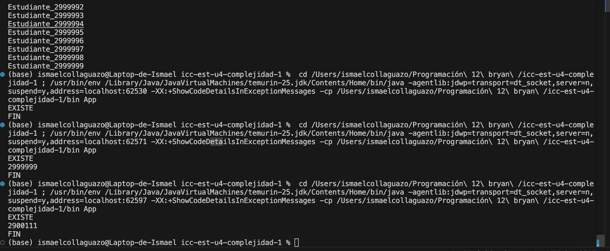

# Práctica: 04.01 complejidad

## Datos del Estudiante
- **Nombre:** [Bryan Fabian Collaguazo Vargas]
- **Curso:** [Estructura de datos]
- **Fecha:** 14.03.2026

---

## 1. [complejidad] o [Practica]

**Fecha:** 14/03/2026

**Descripción:** creamos un proyecto y subimos a git hub

---

## 2. icc-est-u4-complejidad

**Fecha:** 15/03/26
**Descripción:** Creamos la clase estudiante y generador y creamos un listado de estudiantes con datos aleatorios para buscar y optimizar la busqueda

---

## 3. icc-est-u4-complejidad

**Fecha:** 15/03/26
**Descripción:** Ejemplos de bucles listados

---
